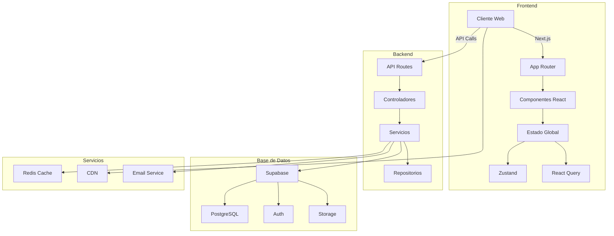
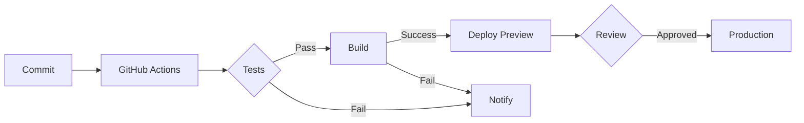

# Arquitectura General

PinteYa! está construido con una arquitectura moderna y escalable, utilizando las mejores prácticas y tecnologías actuales.

## Diagrama de Arquitectura



## Capas de la Aplicación

### 1. Frontend (Cliente)

- **Framework**: Next.js 13+ con App Router
- **UI**: React + Tailwind CSS + Shadcn/ui
- **Estado**:
  - Zustand para estado global
  - React Query para estado del servidor
- **Formularios**: React Hook Form + Zod

### 2. Backend (Servidor)

- **API**: Next.js API Routes
- **Autenticación**: NextAuth.js + Supabase Auth
- **Validación**: Zod
- **Caché**: Redis

### 3. Base de Datos

- **Principal**: PostgreSQL (Supabase)
- **Caché**: Redis
- **Almacenamiento**: Supabase Storage

## Flujo de Datos

1. **Request del Cliente**

   ```mermaid
   sequenceDiagram
       Cliente->>+Next.js: Request HTTP
       Next.js->>+API Route: Procesa Request
       API Route->>+Servicio: Llama Servicio
       Servicio->>+DB: Query
       DB->>-Servicio: Resultado
       Servicio->>-API Route: Respuesta
       API Route->>-Next.js: Datos
       Next.js->>-Cliente: Respuesta HTML/JSON
   ```

2. **Actualización de Estado**
   ```mermaid
   sequenceDiagram
       Cliente->>+React Query: Mutación
       React Query->>+API: Request
       API->>+DB: Update
       DB->>-API: Confirmación
       API->>-React Query: Respuesta
       React Query->>-Cliente: UI Update
   ```

## Seguridad

### Autenticación

- JWT para tokens de acceso
- Refresh tokens para sesiones largas
- 2FA opcional

### Autorización

- RBAC (Role-Based Access Control)
- Políticas a nivel de base de datos
- Middleware de validación

## Optimización

### Performance

- SSR/SSG según necesidad
- Caché en múltiples niveles
- CDN para assets

### SEO

- Metadata dinámica
- Sitemap automático
- Rutas amigables

## Monitoreo

- **Logs**:
  - Aplicación
  - Acceso
  - Errores
- **Métricas**:
  - Performance
  - Uso
  - Errores
- **Alertas**:
  - Disponibilidad
  - Performance
  - Seguridad

## Escalabilidad

### Horizontal

- Serverless functions
- Caché distribuido
- CDN global

### Vertical

- Optimización de queries
- Índices de base de datos
- Compresión de assets

## Integración Continua



## Consideraciones Futuras

1. **Microservicios**

   - Separar funcionalidades críticas
   - API Gateway
   - Service Mesh

2. **Machine Learning**

   - Recomendaciones
   - Análisis de fraude
   - Predicción de demanda

3. **Internacionalización**
   - Múltiples idiomas
   - Múltiples monedas
   - Múltiples regiones

## Referencias

- [Documentación de Next.js](https://nextjs.org/docs)
- [Supabase](https://supabase.com/docs)
- [Arquitectura de Referencia](https://12factor.net/)
