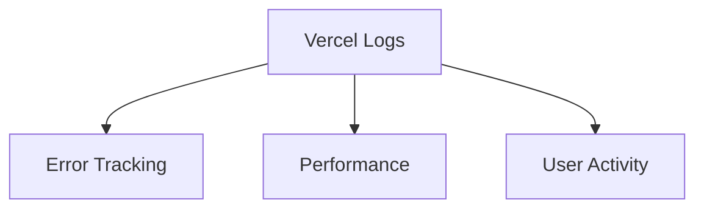
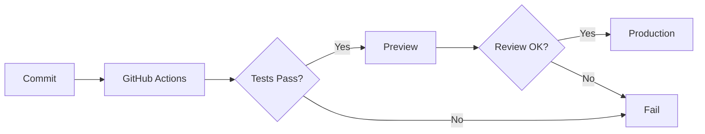

# Guía de Despliegue

Esta guía te ayudará a desplegar PinteYa! en producción utilizando Vercel y Supabase.

## Preparación

### 1. Requisitos Previos

- Cuenta en [Vercel](https://vercel.com)
- Cuenta en [Supabase](https://supabase.com)
- Dominio personalizado (opcional)

### 2. Variables de Entorno

Asegúrate de tener todas las variables de entorno necesarias:

```env
# Supabase
NEXT_PUBLIC_SUPABASE_URL=
NEXT_PUBLIC_SUPABASE_ANON_KEY=
SUPABASE_SERVICE_ROLE_KEY=

# Autenticación
NEXTAUTH_URL=
NEXTAUTH_SECRET=

# Redis (opcional)
REDIS_URL=

# Stripe (opcional)
STRIPE_SECRET_KEY=
STRIPE_WEBHOOK_SECRET=
```

## Despliegue en Vercel

### 1. Configuración Inicial

1. Conecta tu repositorio de GitHub con Vercel
2. Selecciona el repositorio `pinteya-ecommerce`
3. Configura el proyecto:
   - Framework Preset: Next.js
   - Root Directory: ./
   - Build Command: `pnpm build`
   - Output Directory: .next

### 2. Variables de Entorno

1. Ve a Settings > Environment Variables
2. Añade todas las variables de entorno necesarias
3. Marca las variables públicas con `NEXT_PUBLIC_`

### 3. Dominio Personalizado

1. Ve a Settings > Domains
2. Añade tu dominio personalizado
3. Configura los registros DNS según las instrucciones

## Configuración de Supabase

### 1. Base de Datos

1. Crea un nuevo proyecto en Supabase
2. Ejecuta las migraciones:
   ```bash
   pnpm supabase db push
   ```

### 2. Autenticación

1. Configura los proveedores de autenticación
2. Añade los dominios permitidos
3. Configura las redirecciones

### 3. Storage

1. Crea los buckets necesarios
2. Configura las políticas de acceso
3. Habilita las transformaciones de imágenes

## Configuración de Redis (Opcional)

Si estás usando Redis para caché:

1. Crea una instancia en [Upstash](https://upstash.com)
2. Obtén la URL de conexión
3. Añade la URL a las variables de entorno

## Configuración de Stripe (Opcional)

Para procesar pagos:

1. Crea una cuenta en [Stripe](https://stripe.com)
2. Configura los webhooks
3. Añade las claves API a las variables de entorno

## Monitoreo

### 1. Logs

Configura el monitoreo de logs:



### 2. Analytics

Implementa análisis con:

- Vercel Analytics
- Google Analytics
- Plausible

### 3. Alertas

Configura alertas para:

- Errores del servidor
- Problemas de rendimiento
- Actividad sospechosa

## CI/CD

El despliegue continuo está configurado a través de:

1. GitHub Actions para pruebas
2. Vercel para preview deployments
3. Producción automática en main



## Lista de Verificación de Despliegue

- [ ] Variables de entorno configuradas
- [ ] Base de datos migrada
- [ ] Autenticación configurada
- [ ] Storage configurado
- [ ] SSL/TLS habilitado
- [ ] Dominio personalizado configurado
- [ ] Monitoreo activado
- [ ] Backups configurados
- [ ] Webhooks configurados
- [ ] Pruebas de producción realizadas

## Solución de Problemas

### Error: Failed to fetch API

1. Verifica las variables de entorno
2. Comprueba los logs de Vercel
3. Verifica la conexión con Supabase

### Error: Authentication failed

1. Verifica las claves de API
2. Comprueba la configuración de CORS
3. Verifica los dominios permitidos

### Error: Database connection failed

1. Verifica la URL de conexión
2. Comprueba los firewalls
3. Verifica los límites de conexión

## Mantenimiento

### Diario

- Monitorear logs
- Verificar métricas
- Revisar alertas

### Semanal

- Revisar backups
- Actualizar dependencias
- Analizar rendimiento

### Mensual

- Revisar seguridad
- Actualizar certificados
- Optimizar base de datos

## Recursos

- [Documentación de Vercel](https://vercel.com/docs)
- [Documentación de Supabase](https://supabase.com/docs)
- [Guía de Next.js](https://nextjs.org/docs/deployment)
