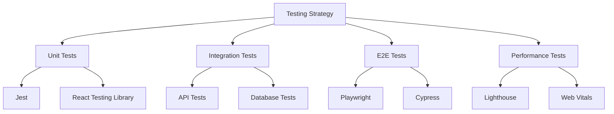

# Guía de Testing

Esta guía cubre las diferentes estrategias y herramientas de testing utilizadas en PinteYa!

## Visión General



## Tests Unitarios

### Configuración de Jest

```typescript
// jest.config.js
module.exports = {
  testEnvironment: 'jsdom',
  setupFilesAfterEnv: ['<rootDir>/jest.setup.js'],
  moduleNameMapper: {
    '^@/(.*)$': '<rootDir>/$1',
  },
  testMatch: ['**/*.test.ts', '**/*.test.tsx'],
}
```

### Ejemplo de Test de Componente

```typescript
import { render, screen } from '@testing-library/react'
import { ProductCard } from './ProductCard'

describe('ProductCard', () => {
  it('renders product information correctly', () => {
    const product = {
      name: 'Pintura Látex',
      price: 2500,
      description: 'Pintura de alta calidad'
    }

    render(<ProductCard product={product} />)

    expect(screen.getByText(product.name)).toBeInTheDocument()
    expect(screen.getByText(`$${product.price}`)).toBeInTheDocument()
    expect(screen.getByText(product.description)).toBeInTheDocument()
  })

  it('handles click events', () => {
    const onClickMock = jest.fn()
    render(<ProductCard onClick={onClickMock} />)

    screen.getByRole('button').click()
    expect(onClickMock).toHaveBeenCalled()
  })
})
```

### Test de Hooks

```typescript
import { renderHook, act } from '@testing-library/react'
import { useCart } from './useCart'

describe('useCart', () => {
  it('adds items to cart', () => {
    const { result } = renderHook(() => useCart())

    act(() => {
      result.current.addItem({
        id: '1',
        name: 'Producto',
        price: 100,
      })
    })

    expect(result.current.items).toHaveLength(1)
    expect(result.current.total).toBe(100)
  })
})
```

## Tests de Integración

### API Tests

```typescript
import { createMocks } from 'node-mocks-http'
import productsHandler from './products'

describe('Products API', () => {
  it('returns products list', async () => {
    const { req, res } = createMocks({
      method: 'GET',
    })

    await productsHandler(req, res)

    expect(res._getStatusCode()).toBe(200)
    const data = JSON.parse(res._getData())
    expect(Array.isArray(data.products)).toBeTruthy()
  })
})
```

### Database Tests

```typescript
import { supabase } from '@/lib/supabase'

describe('Database Operations', () => {
  beforeEach(async () => {
    // Limpiar datos de prueba
    await supabase.from('products').delete().neq('id', 0)
  })

  it('creates and retrieves products', async () => {
    const product = {
      name: 'Test Product',
      price: 100,
    }

    const { data: created } = await supabase
      .from('products')
      .insert(product)
      .select()
      .single()

    expect(created.name).toBe(product.name)

    const { data: retrieved } = await supabase
      .from('products')
      .select()
      .eq('id', created.id)
      .single()

    expect(retrieved).toEqual(created)
  })
})
```

## Tests E2E

### Configuración de Playwright

```typescript
// playwright.config.ts
import { PlaywrightTestConfig } from '@playwright/test'

const config: PlaywrightTestConfig = {
  testDir: './e2e',
  use: {
    baseURL: 'http://localhost:3000',
    screenshot: 'only-on-failure',
  },
  projects: [
    {
      name: 'Chrome',
      use: { browserName: 'chromium' },
    },
    {
      name: 'Firefox',
      use: { browserName: 'firefox' },
    },
  ],
}

export default config
```

### Ejemplo de Test E2E

```typescript
import { test, expect } from '@playwright/test'

test('complete checkout flow', async ({ page }) => {
  // Login
  await page.goto('/login')
  await page.fill('[name=email]', 'test@example.com')
  await page.fill('[name=password]', 'password123')
  await page.click('button[type=submit]')

  // Add product to cart
  await page.goto('/products')
  await page.click('text=Add to Cart')

  // Checkout
  await page.goto('/cart')
  await page.click('text=Proceed to Checkout')

  // Fill shipping info
  await page.fill('[name=address]', 'Test Street 123')
  await page.fill('[name=city]', 'Test City')
  await page.click('text=Continue to Payment')

  // Verify success
  await expect(page.locator('text=Order Confirmed')).toBeVisible()
})
```

## Tests de Performance

### Web Vitals

```typescript
import { onCLS, onFID, onLCP } from 'web-vitals'

function reportWebVitals(metric) {
  console.log(metric.name, metric.value)

  // Enviar a análisis
  analytics.track('Web Vitals', {
    metric: metric.name,
    value: metric.value,
  })
}

onCLS(reportWebVitals)
onFID(reportWebVitals)
onLCP(reportWebVitals)
```

### Lighthouse CI

```yaml
name: Lighthouse CI
on: [push]
jobs:
  lighthouse:
    runs-on: ubuntu-latest
    steps:
      - uses: actions/checkout@v3
      - name: Run Lighthouse
        uses: treosh/lighthouse-ci-action@v9
        with:
          urls: |
            https://pinteya.vercel.app/
            https://pinteya.vercel.app/products
          budgetPath: ./budget.json
          uploadArtifacts: true
```

## Mejores Prácticas

### 1. Organización de Tests

```
src/
  components/
    ProductCard/
      ProductCard.tsx
      ProductCard.test.tsx
      ProductCard.stories.tsx
  hooks/
    useCart/
      useCart.ts
      useCart.test.ts
  pages/
    products/
      [id].tsx
      [id].test.tsx
```

### 2. Mocking

```typescript
// Mocking de módulos
jest.mock('@/lib/supabase', () => ({
  supabase: {
    from: jest.fn().mockReturnThis(),
    select: jest.fn().mockReturnThis(),
    eq: jest.fn().mockResolvedValue({ data: mockData }),
  },
}))

// Mocking de fetch
global.fetch = jest.fn().mockResolvedValue({
  json: () => Promise.resolve(mockData),
})
```

### 3. Fixtures

```typescript
// fixtures/products.ts
export const products = [
  {
    id: '1',
    name: 'Product 1',
    price: 100,
  },
  // ...
]

// Test
import { products } from '../fixtures/products'

test('renders product list', () => {
  render(<ProductList products={products} />)
})
```

## Automatización

### GitHub Actions

```yaml
name: Tests
on: [push, pull_request]

jobs:
  test:
    runs-on: ubuntu-latest
    steps:
      - uses: actions/checkout@v3

      - name: Setup Node.js
        uses: actions/setup-node@v3
        with:
          node-version: '18'

      - name: Install dependencies
        run: pnpm install

      - name: Run unit tests
        run: pnpm test

      - name: Run E2E tests
        run: pnpm test:e2e

      - name: Upload coverage
        uses: codecov/codecov-action@v3
```

## Métricas y Reportes

### Cobertura de Código

```typescript
// jest.config.js
module.exports = {
  collectCoverage: true,
  coverageReporters: ['text', 'lcov'],
  coverageThreshold: {
    global: {
      branches: 80,
      functions: 80,
      lines: 80,
      statements: 80,
    },
  },
}
```

### Reportes Visuales

- [Jest HTML Reporter](https://github.com/Hargne/jest-html-reporter)
- [Playwright HTML Reporter](https://playwright.dev/docs/test-reporters#html-reporter)

## Recursos

- [Jest Documentation](https://jestjs.io/docs/getting-started)
- [React Testing Library](https://testing-library.com/docs/react-testing-library/intro/)
- [Playwright Documentation](https://playwright.dev/docs/intro)
- [Web Vitals](https://web.dev/vitals/)
