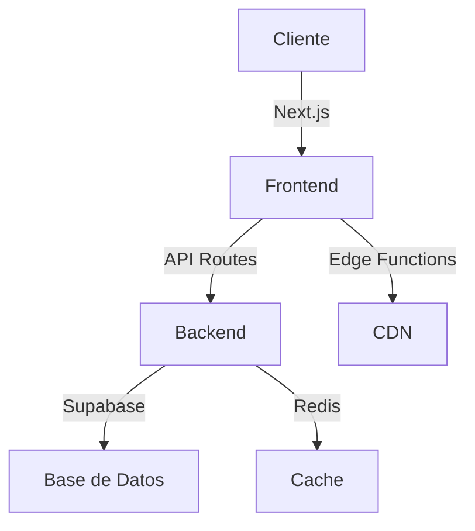

# Bienvenido a PinteYa! 🎨

## Acerca de PinteYa!

PinteYa! es una plataforma de comercio electrónico moderna especializada en la venta de pinturas y productos relacionados. Nuestro objetivo es proporcionar una experiencia de compra excepcional tanto para compradores como para vendedores en el mercado de pinturas.

## Características Principales

### Para Compradores 🛒

- Catálogo intuitivo con búsqueda avanzada
- Sistema de carrito de compras optimizado
- Proceso de pago seguro
- Seguimiento de pedidos en tiempo real
- Sistema de reseñas y calificaciones

### Para Vendedores 💼

- Panel de administración completo
- Gestión de inventario
- Análisis de ventas
- Herramientas de marketing
- Gestión de pedidos

### Para Administradores 🔧

- Control total del sistema
- Gestión de usuarios
- Análisis avanzado
- Configuración de seguridad
- Monitoreo en tiempo real

## Arquitectura

## Comenzando

- 📚 [Guía de Instalación](guides/installation.md)
- 💻 [Guía de Desarrollo](guides/development.md)
- 🚀 [Guía de Despliegue](guides/deployment.md)
- 🤝 [Cómo Contribuir](contributing/guide.md)

## Recursos Adicionales

- [GitHub Repository](https://github.com/SantiagoMartinezMm/pinteya-ecommerce)
- [Documentación de la API](api/introduction.md)
- [Changelog](changelog.md)

## Soporte

Si necesitas ayuda, puedes:

1. Revisar nuestra [documentación](https://santiagomartinezmm.github.io/pinteya-ecommerce)
2. Abrir un [issue](https://github.com/SantiagoMartinezMm/pinteya-ecommerce/issues)
3. Contactar al equipo de desarrollo
